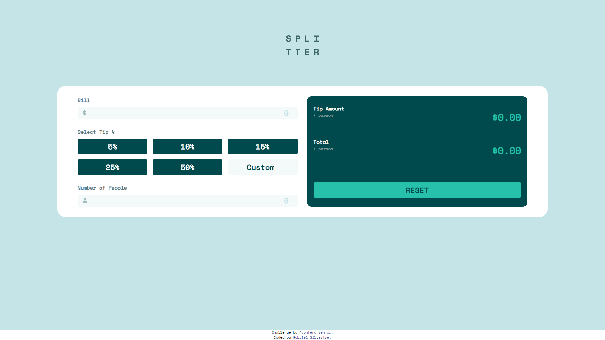

# tip_calculator

# Frontend Mentor - Tip calculator app solution

This is a solution to the [Tip calculator app challenge on Frontend Mentor](https://www.frontendmentor.io/challenges/tip-calculator-app-ugJNGbJUX). Frontend Mentor challenges help you improve your coding skills by building realistic projects.

## Table of contents

- [Overview](#overview)
  - [The challenge](#the-challenge)
  - [Screenshot](#screenshot)
  - [Links](#links)
- [My process](#my-process)
  - [Built with](#built-with)
  - [What I learned](#what-i-learned)
  - [Continued development](#continued-development)
  - [Useful resources](#useful-resources)
- [Author](#author)


## Overview

### The challenge

Users should be able to:

- View the optimal layout for the app depending on their device's screen size
- See hover states for all interactive elements on the page
- Calculate the correct tip and total cost of the bill per person

### Screenshot



### Links

- Solution URL: [Add solution URL here](https://your-solution-url.com)
- Live Site URL: [Add live site URL here](https://your-live-site-url.com)

## My process

### Built with

- Semantic HTML5 markup
- CSS custom properties
- Flexbox
- CSS Grid
- Mobile-first workflow
- MVC design pattern


### What I learned

In this project my biggest difficult was work with DOM events, i had learn too how to build a custom radio button with only HTML and CSS. Below this introduction
i put parts of the code of the radio button and the event listenner. To do this button i had search in the web for some examples and the one witch was more "understandible" was the
[W3School example](https://www.w3schools.com/howto/howto_css_custom_checkbox.asp)

```html
<div id="tip_options">
                <label class="btn_1 btn_tips" value="0.05">
                    <input class="ipt_tips" type="radio" name="tip_percentage" value="0.05">
                    <span class="checkmark">5%</span>
                </label>
</div>
```
```css
.btn_tips {
    display: flex;
    align-items: center;
    justify-content: center;

    position: relative;

    font-size: 24px;
    font-weight: 700;
    color: var(--My_white);

    border: 1px solid transparent;
    border-radius: 5px;

    -webkit-user-select: none;
    -moz-user-select: none;
    -ms-user-select: none;
    user-select: none;

    background-color: var(--Very_dark_cyan);
}
.btn_tips input {
    position: absolute;
    opacity: 0;

    cursor: pointer;
}
.checkmark {
    display: flex;
    align-items: center;
    justify-content: center;

    position: relative;

    padding: 0.3rem 1.2rem;

    border: 1px solid transparent;
    border-radius: 5px;

    height: 100%;
    width: 100%;
}
.btn_tips:hover input ~ .checkmark {
    color: var(--Very_dark_cyan);
    background-color: var(--Strong_cyan);
}
.btn_tips:hover {background-color: var(--Strong_cyan);}
.btn_tips input:checked  ~ .checkmark{
    color: var(--Very_dark_cyan);
    background-color: var(--Strong_cyan);
}
```
```js
document.addEventListener("DOMContentLoaded", () => {
    let people_bill = document.querySelectorAll(".input_pattern");
    people_bill.forEach((info) => {
        info.addEventListener("input", get_bill);
    })


    let people_tip = document.querySelectorAll(".ipt_tips");
    people_tip.forEach((tip_option) => {
        tip_option.addEventListener("click", get_tip);
    })

    let custom_check = document.querySelector("#custom_check");
    custom_check.addEventListener("click", focus_change_tip)

    document.querySelector("main").addEventListener("input", () => {
        min_values();
        
        show_tip(tip_person());
    })

    document.querySelector(".btn_reset").addEventListener("click", () => {
        window.location.reload();
    })    
})
}
```


### Continued development

I pretend to continue training my basic JavaScript using the event listener to do DOM events and learn more about custom input types like checkbox, radio and submit for example.
At all i could do a better job for the responsivity, but my primary objective in thes project was learn more about DOM events.

### Useful resources

- [Custom radio buttons](https://www.w3schools.com/howto/howto_css_custom_checkbox.asp) - This helped me with the HTML structure and CSS customize for radio buttons. I really liked this pattern and will use it going forward.


## Author

- Frontend Mentor - [@gabrielh_silvestre](https://www.frontendmentor.io/profile/gabrielh-silvestre)
- Linkedin - [Gabriel Silvestre](https://www.linkedin.com/in/gabrielh-silvestre/)
